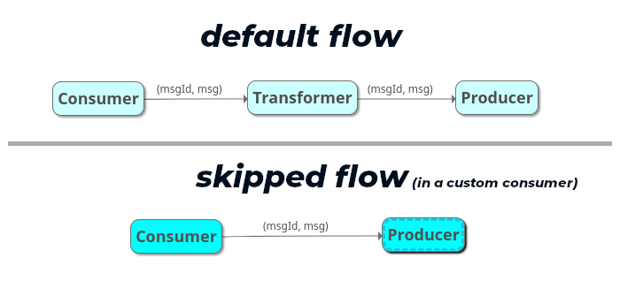

## Ogi

> **Ogi** is a thin core utility that's a "context free", "customizable utility" workflow runner.

Built with purpose to have a mix-n-match steps for [ETL](https://en.wikipedia.org/wiki/Extract,_transform,_load) like scenarios; but with bi-directional flows giving it more possibilities.

> 

### What Is It Now?

In its basic design, it would allow one to use available (or separately/privately written) flows at any/all stages of `Consumer`, `Transformer` & `Producer`.

* `Consumer` is the init point, that spins up any kind of data retrieval or listens to published requests. Then hands them over to configured `Transformer`. Like reading a file line-by-line, reading records from a database, subscribing to a kafka topic, etc.

* `Transformer` has the flow for any checks/edits required on received data; any pre-final task spins. Then the desired form of received data is handed over to configured `Producer`. Like checking if keys are valid before Producer persists it, create a JSON based on it that can be sent as a Request by Producer, etc.

* `Producer` contains the final action desired on the desired state of data/request received via Consumer-to-Transformer. It could be parsist to a file, send to a Kafka topic, add a database entry, make a custom HTTP Request, etc.

> * Allows custom components for Consumer/Transformer/Producer to be dynamically loaded via [Golang Plug-ins](https://pkg.go.dev/plugin).
>
> * Each Ogi run can pick a suitable type of each based on configuration; allowing all sorts of mix-match.
>
> * `Producer` can return an info response to `Transformer`; and it to `Consumer`. So even bidirectional flows are possible.
>
> * Each flow gets logged with a `Message ID`; so one can debug/err-check/observe events.

*Repo for stable plug-ins is [OpenChaos/ogi-plugin-umbrella](https://github.com/OpenChaos/ogi-plugin-umbrella).*

#### What's the FLEXIBILITY about?

* Ogi uses env config to identify which Consumer, Transformer & Producer are to be used. Plug-ins can be used by providing `plugin` value and env for `<plug-in>.so` file path.

> 

* Ogi's default flow invokes a Transformer for each data recieved at Consumer. When writing a custom consumer plug-in, if data can be directly handed over to Producer.. `Produce(..)` can be called from `Consume(..)` itself in a skipped flow.

> * Ogi's core contains a `transparent` Transformer, that can be used as a clean pass-through as well. All Consumer in Ogi's core or official plugin repo.. follow default flow, and can utilize it if need be.

> * One can have combination of say Kafka consumer with kubernetes-log transformer alongwith custom plug-in of Google Cloud Datastore for cold storage of logs.
>
> * This also gives capability to write a producer sending output to more than one output sinks in same flow to achieve replication.

* The bi-directional flow, allows the consumer/transformer to recieve some info on flow and take further steps. For e.g.

> Examples:
>
> * An HTTP Service Consumer, this allows one to get a return value on action taken and pass it back as HTTP Response.
>
> * In case of failure at Transformer or Producer, can persist the actual state at which the flow failed and build a state machine to resume it for only what's left to be done.

---

**WIP**

#### Concepts

#### Examples

#### Quickstart

---

### How It Started?

In 2018, initially written to fan-out bulk topic `labels[app:appname]` tagged logs pushed from Kubernetes to Kafka, into `app` specific topics.

> There were different Kafka sinks across different clusters, to be funneled to service specific topics to a central sink for varied Observability & Analytics purpose.
>
> This came to be as regular PoC on a Sunday, in Production on Monday.. a simple env configurable data cruncher binary. Simple & Sturdy. But sent to the dark dungeon of Prod PoCs left to run.

---
